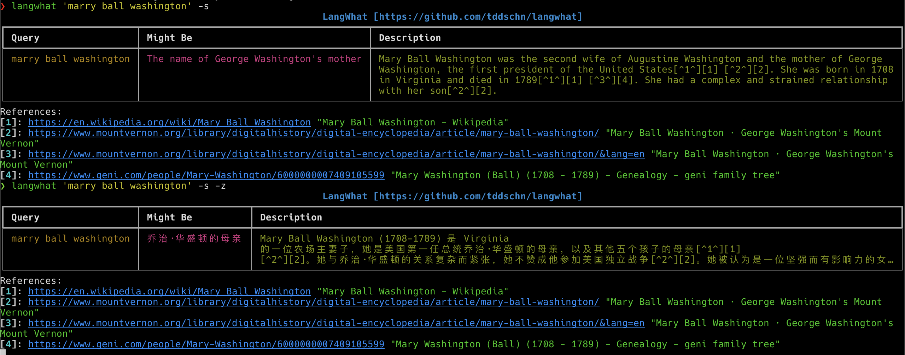
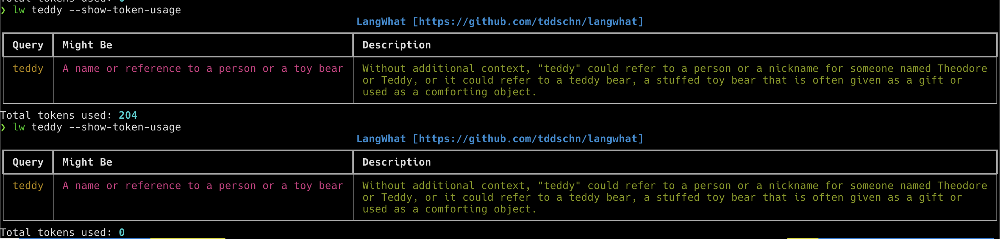

# LangWhat

Answer "What is it?" on the command line with the power of large language models (LLMs).

[pyWhat](https://github.com/bee-san/pyWhat) LLM version, leveraging OpenAI API and Sydney (coming soon).

- [LangWhat](#langwhat)
  - [Screenshots](#screenshots)
    - [OpenAI](#openai)
    - [Sydney](#sydney)
    - [Caching](#caching)
  - [Features](#features)
  - [Installation](#installation)
    - [pipx](#pipx)
    - [pip](#pip)
  - [Usage](#usage)
  - [Develop](#develop)
  - [Credits](#credits)

## Screenshots

### OpenAI

```bash
langwhat 'f7316ffccd4d2d555a7522328cf792dd73bfbcd9'

langwhat 'f7316ffccd4d2d555a7522328cf792dd73bfbcd9' --zh
```


### Sydney

Sydney fixed my type "marry" automatically.

```bash
langwhat 'marry ball washington' -s

langwhat 'marry ball washington' -s -z
```




### Caching

Responses are much faster when cache hits, and token usage becomes 0.

Note that Sydney doesn't support counting token usage, and always shows 0.

```bash
lw teddy --show-token-usage

lw teddy --show-token-usage
```


## Features
- Uses few-shot prompting to reduce model mis-behavior
- English by default for superior response speed and accuracy
- Supports supplying API Key via either environment variable or config file at `~/.config/langwhat/api_key.txt`
- Supports using [Sydney](https://www.bing.com/search?q=Bing+AI&showconv=1) with `-s` flag
- Caching responses in a local sqlite database


## Installation

### pipx

This is the recommended installation method.

```
$ pipx install langwhat

# python 3.11 or higher is required, if your pipx uses a lower version of python by default,
# you could run the following command to install langwhat with python 3.11
# pipx install --python "$(which python3.11)"
```

### [pip](https://pypi.org/project/langwhat/)

```
$ pip install langwhat
```


## Usage

```
$ langwhat --help

usage: lw [-h] [-z] [-s] [-C] [--show-token-usage] [-V] what

positional arguments:
  what                what is it

options:
  -h, --help          show this help message and exit
  -z, --zh            Use Mandarin to prompt and answer
  -s, --sydney        Use Sydney (Bing AI) instead of OpenAI
  -C, --no-cache      Disable cache
  --show-token-usage  Show token usage
  -V, --version       show program's version number and exit
```


## Develop

```
$ git clone https://github.com/tddschn/langwhat.git
$ cd langwhat
$ poetry install
```

## Credits
- LangChain
- [EdgeGPT](https://github.com/acheong08/EdgeGPT)
- [Yihong](https://github.com/yihong0618/iWhat)