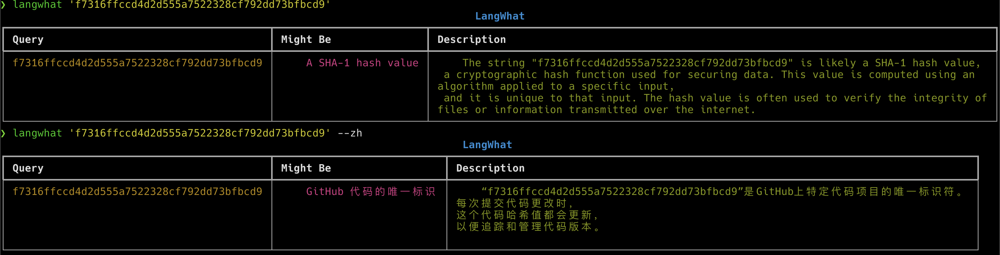

# langwhat
What is it? 

[pyWhat](https://github.com/bee-san/pyWhat) LLM version, leveraging OpenAI API and Sydney (coming soon).

Modified from Yihong's [iWhat](https://github.com/yihong0618/iWhat).

- [langwhat](#langwhat)
  - [Screenshots](#screenshots)
  - [Improvements](#improvements)
  - [Installation](#installation)
    - [pipx](#pipx)
    - [pip](#pip)
  - [Usage](#usage)
  - [Roadmap](#roadmap)
  - [Develop](#develop)
  - [Credits](#credits)

## Screenshots



## Improvements
- Uses few-shot prompting to reduce model mis-behavior
- English by default for superior response speed and accuracy


## Installation

### pipx

This is the recommended installation method.

```
$ pipx install langwhat
```

### [pip](https://pypi.org/project/langwhat/)

```
$ pip install langwhat
```


## Usage


First, set your OpenAI API key as an environment variable:

```bash
export OPENAI_API_KEY=<sk-XXXX> # replace it with your OpenAI API key
```

Then start using it by passing any string to the `langwhat` command.

```
$ langwhat --help

usage: langwhat [-h] [-z] what

positional arguments:
  what        what is it

options:
  -h, --help  show this help message and exit
  -z, --zh    If use Mandarin to answer
```


## Roadmap
- [ ] Integrate [Sydney](https://www.bing.com/search?q=Bing+AI&showconv=1)

## Develop

```
$ git clone https://github.com/tddschn/langwhat.git
$ cd langwhat
$ poetry install
```

## Credits
- [Yihong](https://github.com/yihong0618/iWhat)
- LangChain